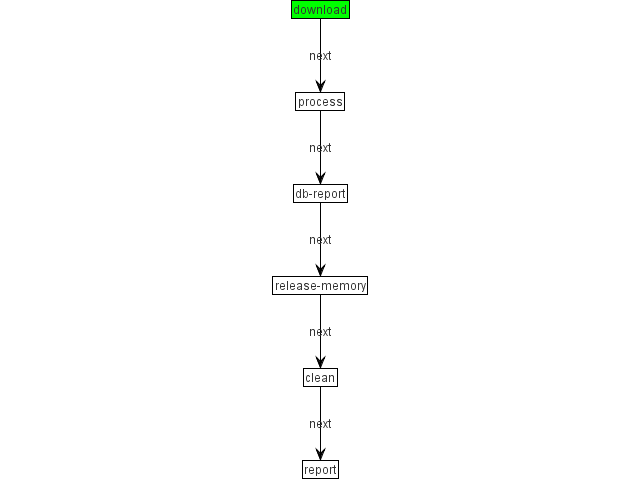

# Data Processing in Financial Services with TomEE (part 1)


This is a joint work of Romain Manni-Bucau and Michal Kalkowski.

The related project is available on github at:

https://github.com/rmannibucau/financial-batch.git


## Overview

The project demonstrates a typical case of maintaining a universe of entities; which are taken from an external source.
In this context that would be a list of securities from XETRA market, which are shared on the website as a file and updated daily. The goal of this batch is to capture these updates and make sure they are reflected in a local database.
Its requirements are similar to those observed in the financial services industry and uses the best-in-class, cutting-edge technologies.

## Constraints

The batch should be:

- Idempotent
- Easily restartable (preferrably from the last point of failure)

## Modes of operation

There are several ways to tackle this problem. As a part of this post we have implemented the first two cases.

1.	Full-streaming: most risky and most efficient for huge amount of data. In this case you have to be sure that the file will be maintained correctly and is not corrupted. (i.e. the maintained dataset will not be subject to errors in processing or erroneous size fluctuations.) This mode uses chunking with a given commit interval for performances. This is implemented in the batch called "file-to-database."
2.	Two-pass streaming: pre-process the file in order to not corrupt the database; in case the file is corrupted. If processing the file results in deleting more than X% of the rows in the current dataset, this typically would mean stopping. Sample implementation in file "semi-streaming" batch.
3.	In-memory comparison: first load the input data to be processed, then load the full existing data set to compare the two. The comparison will allow you to make a decision about the relative difference between the two datasets in terms of number of updates, inserts and deletes. This gives you very fine-grained decision variables but also obligates you to work in-memory. 

## Proof-of-concept

The program is run as a series of loosely-coupled steps which are listed below. The technological stack is described in more details in the next paragraph.

The overall flow is described in this diagram:
 


1.	Download: download the file from remote location and store it as a cache in a defined directory. This is to prevent the file from being re-downloaded in case of failure. It also ensures you can investigate an error if the batch fails (can be due to incoming data).
2.	Pre-process (only when using two-pass) : read the input and estimate if the resulting number of deletions will exceed a given threshold.
3.	Process: read the CSV file, transform each line into a POJO (Reader). Transform the POJO to a different domain (Processor) and synchronize it with the database (Writer).
4.	DB-report: log in detail which instruments are new/updated/stale. This is only for investigation and auditing purposes.
5.	Release-memory: clean the state which is passed from the steps before. Process and DB-report steps are communicated through shared data in `JobContext`. To avoid keeping these data, which can be huge in-memory, we reset them during this step.
6.	Clean: delete the locally cached file. Note: this is a simple algorithm, in practise we would archive it (mainly a move + renaming).
7.	Report: log statistics of the execution for each step or some steps. This step is mainly for the demo purposes. In practice we would use BatchEE reporting GUI to monitor executions.

## Technology Stack

The program is written using JSR-352 (Batch Processing for Java Platform). It was introduced in Java EE 7 platform to provide a programming model for running and managing batches. We are using the BatchEE implementation of this standard; which is the implementation you'll find in Apache TomEE. Additionally we reused some "extra" BatchEE modules. These modules are developed at Apache by the BatchEE community but are portable; meaning you can reuse them without BatchEE (i.e. using JBeret.)

Here are the ones we relied on:

- `batchee-extras`: provide a set of standard API/components. We mainly use from this module the typed version of JBatch component to avoid casting our items (which breaks the code readability).
- `batchee-beanio`: this module integrates JBatch with the excellent BeanIO library. This is the one allowing us to read our input CSV file without any line of code.
- `batchee-modelmapper`: this module integrates JBatch with the ModelMapper library. We rely on this library to convert our CSV DTO to our JPA entities. Thanks to ModelMapper library (which includes auto mapping discovery) this is done without any difficulties.

### Enter into the code

The most interesting step of our batch is the process one. This one is a chunk; meaning it is split in 3 phases:

- Reader: responsible to stream data
- Processor: taking reader data and "working" on them (in our case it is just a conversion/mapping)
- Writer: responsible to finish the work on the processed data (persistence in our case)

Our process step then looks like:

````xml
<step id="process" next="db-report">
  <chunk>
    <reader ref="org.apache.batchee.beanio.BeanIOReader">
      <properties>
        <property name="file" value="#{jobParameters['downloadCache']}"/>
        <property name="streamName" value="readerCSV"/>
        <property name="configuration" value="beanio.xml"/>
        <property name="skippedHeaderLines" value="5"/>
      </properties>
    </reader>
    <processor ref="org.apache.batchee.modelmapper.ModelMapperItemProcessor">
      <properties>
        <property name="matchingStrategy" value="LOOSE" />
        <property name="destinationType" value="com.supertribe.sample.financial.batch.writer.entity.JpaInstrument" />
      </properties>
    </processor>
    <writer ref="jpa">
        <properties>
          <property name="propagateStatus" value="true" />
        </properties>
    </writer>
  </chunk>
</step>
````

Since we reused existing components for the Reader (`BeanIOReader`) and the Processor (`ModelMapperItemProcessor`)
their references are their fully qualified names (note: in BatchEE you can use short names as well, but it is not portable).
Their configuration is straight-forward and directly maps the underlying library configuration.

Finally we wrote a custom writer to handle the JPA persistence of our instruments. It is named "jpa" thanks to CDI `@Named`
qualifier. Its `propagateStatus` configuration allows for propagating in the `JobContext` the state of the entities (i.e. is it a new entry, was it updated, should it be deleted).

Here is what our writer looks like:

```java
@Named("jpa")
public class JPAWriter extends NoStateTypedItemWriter<JpaInstrument> {
    @PersistenceContext
    private EntityManager em;

    @Inject
    private JobContext context;

    @Inject
    @BatchProperty
    private Boolean propagateStatus;

    private Map<JpaInstrument.Id, Item<JpaInstrument>> all;

    @PostConstruct
    private void cacheDb() { // supposes the batch is the only one to write for its execution duration, acceptable for reference db
        // avoid em.getReference(JpaInstrument.class, instrument.getId()); in doWriteItems and N db hits
        all = em.createNamedQuery("JpaInstrument.findAll", JpaInstrument.class)
                .getResultList().stream()
                .map(i -> new Item<>(i, null))
                .collect(toMap(i -> i.value.getId(), identity()));
    }

    @Override
    protected void doWriteItems(final List<JpaInstrument> list) {
        list.stream().forEach(instrument -> {
            if (Optional.ofNullable(all.get(instrument.getId())).isPresent()) {
                em.merge(instrument);
                all.put(instrument.getId(), new Item<>(instrument, false));
            } else {
                em.persist(instrument);
                all.put(instrument.getId(), new Item<>(instrument, true));
            }
        });
        if (propagateStatus != null && propagateStatus) {
            context.setTransientUserData(all); // allow next step to reuse it if needed
        }
    }

    public static class Item<T> { // skipping constructor and getters for readability
        private final T value;
        private Boolean isNew;
    }
}
```

Interesting things to note about this Writer are:

- It is a plain CDI bean so we can get injections into any bean
- It uses JBatch configuration thanks to `@BatchProperty` qualifier
- It uses a query to preload, in-memory, all the databases to have a faster runtime processing. Note: if there is a natural ordering on the dataset on both sides (input and database) it can be optimized by loading only the chunk data (i.e. loading only data for a single commit interval).
- It uses `JobContext#setTransientData` to share data with next step(s)


## BatchEE Advantages

A sure advantage of this kind of programming model is the ability to easily test the units, steps and jobs independently.
The responsibility of each component is clearly limited and its purpose gives a clear indication of its purpose, (e.g. Readers, Processors, Writers and Listeners.) It really allows for reusability (like we did with `BeanIOReader`.)

Another strong point is the freedom of changing input or output of the flow without impacting the whole processing logic.
Moving from database to a queue requires the change of only one clearly defined component. The maintenance of such a system is surely less costly than custom alternatives. It also allows for a restart of a batch to a particular step without having to write another batch (rewiring all parts of the batch). This is a feature of JBatch.

Performance is also much easier to achieve given that you have an easy way of implementing pipelining and chunking. When done manually it is rarely well done. JBatch doesn't prevent you from customizing the commit interval algorithm; which allows you to have very advanced logic here.

It's worth mentioning that JBatch provides you listeners for all part of the batch (Job, Step, Reader, Processor, Writer, etc.) This allows you to not only audit but also very easily customize your batch without impacting the component programming model.

## Error Handling

There are several strategies of handling the runtime errors in a batch, and whichever you choose, it has to be stated upfront and communicated clearly. Errors may result from several problems: malformed data, network errors, failed business validation, etc.  It is recommended to simulate how the application will behave in case of each error.

Side note: without going into details, you should know that BatchEE provides a test module simplifying the testing of steps.

1.	All or nothing: hard to achieve as it basically means you have to pass all the entities through the whole chain (including DB persistence), and rollback everything in case of an error.
2.	Best-effort: even if an error occurs, continue. This option is available if desired. In this case you just ensure the failure is visible (in either the BatchEE GUI or by sending an email at the end of the batch.)
3.	Stop on error: once the error is identified, the application stops with a FAILED status. This results in a potentially partially-complete execution. This type is used in the provided sample.

The way errors will be redelivered or mitigated is not a part of this categorization. The two main cases are:

- Auto-retry: can be done with EIP Dead Letter Channel pattern
- Human handling: ensure a human is notified and it stay in FAILED status until it is resolved (often means restarted and succeeded.)

## Sample executions

Just to make it more concrete, here are simple execution logs. It was collected using BatchEE CLI (the ability to run batches from the command line). Interesting point is it supports execution of batches from a WAR file.

    $ ./bin/batchee start \
            -lifecycle openejb \
            -archive financial-batch.war \
            -name file-to-database \
            inputURL=http://www.xetra.com/blob/1424940/cdbb8e95489e25f891f537f70375fb04/data/allTradableInstruments.csv \
            downloadCache=work/cache.csv
    
    (...)
    
    31-mar-2015 21:59:15.429 INFO [main] org.apache.webbeans.config.BeansDeployer.validateInjectionPoints All injection points were validated successfully.
    31-mar-2015 21:59:15.434 INFO [main] org.apache.openejb.cdi.OpenEJBLifecycle.startApplication OpenWebBeans Container has started, it took 316 ms.
    31-mar-2015 21:59:15.443 INFO [main] org.apache.openejb.assembler.classic.Assembler.createApplication Deployed Application(path=c:\apps\apache-batchee-0.3-incubating-SNAPSHOT\work\financial-batch-1.0-SNAPSHOT.war)
    
     ____        _       _     ______ ______
    |  _ \      | |     | |   |  ____|  ____|
    | |_) | __ _| |_ ___| |__ | |__  | |__
    |  _ < / _` | __/ __| '_ \|  __| |  __|
    | |_) | (_| | || (__| | | | |____| |____
    |____/ \__,_|\__\___|_| |_|______|______|0.3-incubating-SNAPSHOT
    Admin mode deactivated, use -socket to activate it
    Batch 'file-to-database' started with id #0
    
    (....)
    
    
    31-mar-2015 21:54:13.225 INFO [batchee-thread-1] com.supertribe.sample.financial.batch.writer.JPAReport.lambda$logStream$4   - JpaInstrument{id=Id{isin='ZAG000106972', mic='XFRA', currency='EUR'}}
    31-mar-2015 21:54:13.226 INFO [batchee-thread-1] com.supertribe.sample.financial.batch.writer.JPAReport.lambda$logStream$4   - JpaInstrument{id=Id{isin='ZAG000106998', mic='XFRA', currency='EUR'}}
    31-mar-2015 21:54:13.226 INFO [batchee-thread-1] com.supertribe.sample.financial.batch.writer.JPAReport.lambda$logStream$4   - JpaInstrument{id=Id{isin='ZAG000107004', mic='XFRA', currency='EUR'}}
    31-mar-2015 21:54:13.227 INFO [batchee-thread-1] com.supertribe.sample.financial.batch.writer.JPAReport.lambda$logStream$4   - JpaInstrument{id=Id{isin='ZAG000107012', mic='XFRA', currency='EUR'}}
    31-mar-2015 21:54:13.238 INFO [batchee-thread-1] com.supertribe.sample.financial.batch.report.Report.doReport Step: process
    31-mar-2015 21:54:13.238 INFO [batchee-thread-1] com.supertribe.sample.financial.batch.report.Report.doReport Execution Id: 1
    31-mar-2015 21:54:13.239 INFO [batchee-thread-1] com.supertribe.sample.financial.batch.report.Report.doReport Status: COMPLETED
    31-mar-2015 21:54:13.239 INFO [batchee-thread-1] com.supertribe.sample.financial.batch.report.Report.doReport Start: Tue Mar 31 21:52:57 CEST 2015
    31-mar-2015 21:54:13.240 INFO [batchee-thread-1] com.supertribe.sample.financial.batch.report.Report.doReport Stop: Tue Mar 31 21:53:03 CEST 2015
    31-mar-2015 21:54:13.240 INFO [batchee-thread-1] com.supertribe.sample.financial.batch.report.Report.doReport Metrics:
    31-mar-2015 21:54:13.243 INFO [batchee-thread-1] com.supertribe.sample.financial.batch.report.Report.lambda$doReport$9   - COMMIT_COUNT = 2
    31-mar-2015 21:54:13.243 INFO [batchee-thread-1] com.supertribe.sample.financial.batch.report.Report.lambda$doReport$9   - FILTER_COUNT = 0
    31-mar-2015 21:54:13.244 INFO [batchee-thread-1] com.supertribe.sample.financial.batch.report.Report.lambda$doReport$9   - PROCESS_SKIP_COUNT = 0
    31-mar-2015 21:54:13.244 INFO [batchee-thread-1] com.supertribe.sample.financial.batch.report.Report.lambda$doReport$9   - READ_COUNT = 15
    31-mar-2015 21:54:13.245 INFO [batchee-thread-1] com.supertribe.sample.financial.batch.report.Report.lambda$doReport$9   - READ_SKIP_COUNT = 0
    31-mar-2015 21:54:13.246 INFO [batchee-thread-1] com.supertribe.sample.financial.batch.report.Report.lambda$doReport$9   - ROLLBACK_COUNT = 0
    31-mar-2015 21:54:13.246 INFO [batchee-thread-1] com.supertribe.sample.financial.batch.report.Report.lambda$doReport$9   - WRITE_COUNT = 15
    31-mar-2015 21:54:13.247 INFO [batchee-thread-1] com.supertribe.sample.financial.batch.report.Report.lambda$doReport$9   - WRITE_SKIP_COUNT = 0
    
    =========================
    Batch status: COMPLETED
    Exit status:  COMPLETED
    Duration:     5s
    =========================
    31-mar-2015 21:54:13.252 INFO [main] org.apache.openejb.assembler.classic.Assembler.destroyApplication Undeploying app: c:\apps\apache-batchee-0.3-incubating-SNAPSHOT\work\financial-batch-1.0-SNAPSHOT.war
    31-mar-2015 21:54:13.550 INFO [main] org.apache.openejb.util.ServiceManagerProxy.stop Stopping network services
    31-mar-2015 21:54:13.550 INFO [main] org.apache.openejb.server.SimpleServiceManager.stop Stopping server services
    31-mar-2015 21:54:13.553 INFO [main] org.apache.openejb.core.LocalInitialContext.tearDownOpenEJB Destroying container system
    31-mar-2015 21:54:13.562 INFO [main] org.apache.openejb.assembler.classic.Assembler.destroyResource Closing DataSource: My DataSource
    31-mar-2015 21:54:13.562 INFO [main] org.apache.openejb.assembler.classic.Assembler.destroyResource Closing DataSource: My Unmanaged DataSource
    31-mar-2015 21:54:13.575 INFO [main] org.apache.openejb.assembler.classic.Assembler.destroyResource Closing DataSource: jdbc

The first part of the logs are the container logs (deployment of the application, setup of CDI/EJB/... etc).
Then after the BatchEE ascii logo, the batch starts and we can identify the report step logging (`JPAReport`) and the step reporting (`Report`). Finally BatchEE report the whole job status as `COMPLETED` (for this execution) before the container shutdowns.


And now for something completely different, a failure of download. The stage at which error occured is clearly visible:

    =========================
    Batch status: FAILED
    Exit status:  FAILED
    Duration:     21s
    
    Step name       : download
    Step status     : FAILED
    Step exit status: FAILED
    =========================


## Conclusions

This post was mainly an overview of what JBatch can do and how it can be smoothly integrated in today's financial systems.

However there are a lot of other elements we didn't fully cover but can be useful for production:
 
- Restart of a failed batch
- How to handle stopping of a batch gracefully
- Testing
- Webapp GUI, JAXRS API
- and much more...

Stay tuned!
